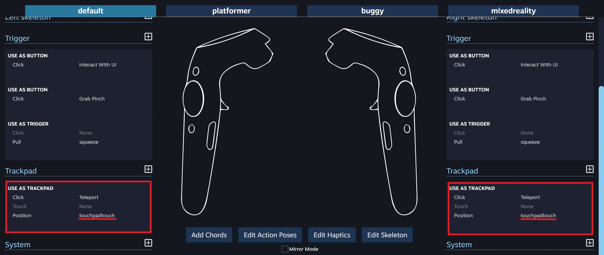
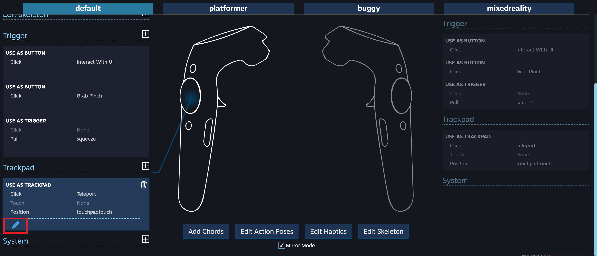
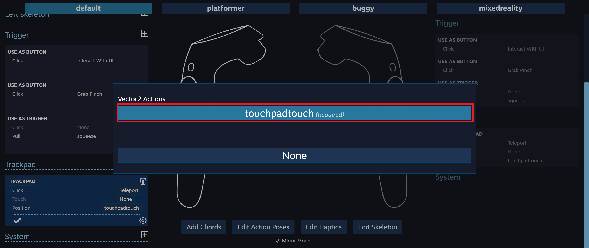
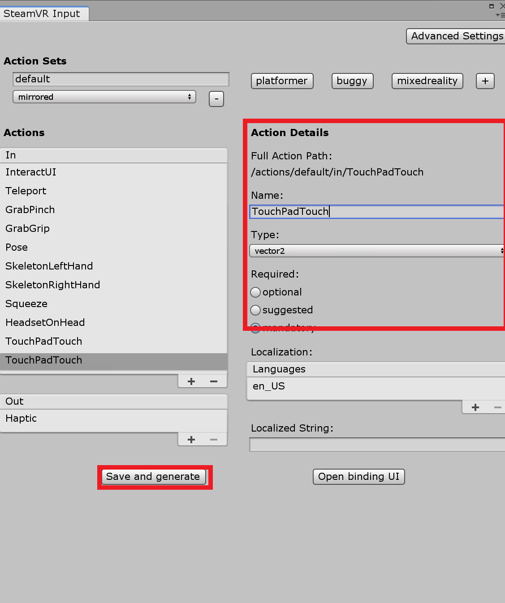

# EasySim (Yizhe Simulator for AV Indoor Environment)

This is a simulation for AV indoor navigation. Currently it supports two scenes(warehouse and haunted house) and two modes
(vr mode and display mode), and several functionalities, including depth rendering, and segmentation camera rendering. 
In the future(by the end of July 2019), it will support more scenes, and hopefully it will also simulate a lidar sensor.

## Examples

### scenes and modes

Users can select different scenes and modes.
### display mode

It renders semantic and depth view on the monitor. Under display mode, users can control the agent using arrow keys.
### vr mode

Under vr mode, users can select depth view/semantic view/ground truth view. Those views will be saved externally.Users can also move around using handle controllers' trackpad.
## Getting Started

1. Install unity (recommend 2018 4.1 and above). [Windows](https://unity3d.com/get-unity/download/archive) [Linux](https://beta.unity3d.com/download/fe703c5165de/public_download.html)
2. Install [Git LFS](https://git-lfs.github.com/) (this should be as simple as `git lfs install`).
3. Clone this repository from Github:
```      git clone https://github.com/kekekekekekekekeke/simulator.git ```
      


### Requirement for VR devices

* This application is developed with HTC vive under *room scale*, also with a special controller binding for the HTC Vive Controller.
* In Unity, go to Window -> SteamVR Input, choose "open binding UI'.
* Alternatively, you can go to SteamVR Menu -> Devices -> Configure Controllers. Press play in your application to get it running then select it under Current Application. Select Edit this binding.
1. Find TrackPad

2. Select the pencil icon to start editing.

3. Choose Position, and select trackpadtouch(required)

4. Save this binding. 
* If you couldn't find trackPadTouch in step 3, in unity, go to Window -> SteamVR Input, under Action, select "+". 

* Add an action called "TouchPadTouch", with type "vector2", and make it mandatory.
* select "save and generate", then you should be able to find trackpadtouch in step 3.


## Deployment
``` TODO: how to make the simulator ROS compatible ``` 

## Built With

* [Unity](https://unity.com/) - The web framework used
* [VIVE](https://www.vive.com/us/) - The headset and controllers


## Authors

* **Ke Jin** - *Initial work* - [kekekekekekekekeke](https://github.com/kekekekekekekekeke)


## License

This project is licensed under the MIT License - see the [LICENSE.md](LICENSE.md) file for details

## Acknowledgments

* cruise control: [USelfDrivingSimulator](https://github.com/EvanWY/USelfDrivingSimulator)
* depth rendering: [unity forum](https://answers.unity.com/questions/877170/render-scene-depth-to-a-texture.html)
* segmentation rendering: [unity ml-imageSynthesis](https://bitbucket.org/Unity-Technologies/ml-imagesynthesis/src/master/)
* Inspiration: [lgsvl](https://github.com/lgsvl/simulator)
* etc
